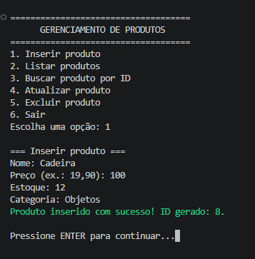
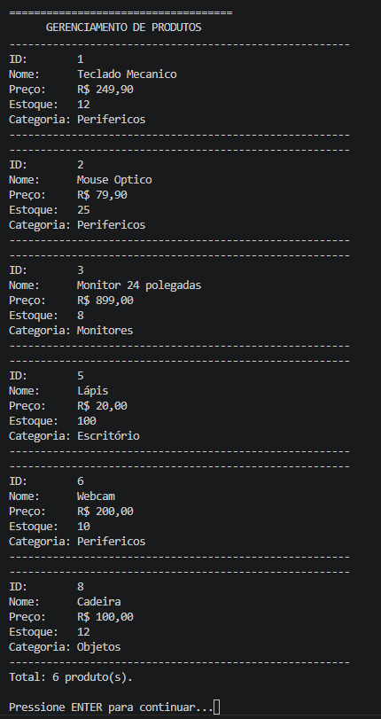
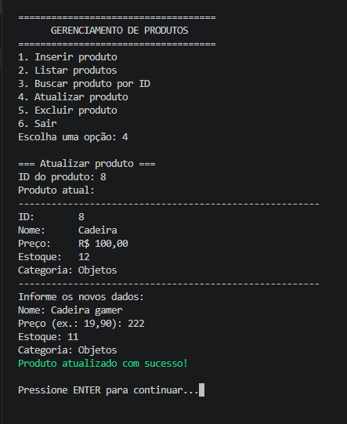
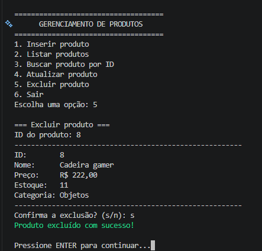
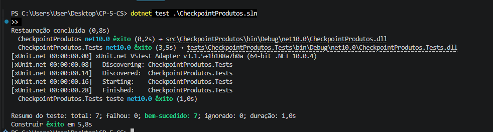

# C# Checkpoint 5 — CRUD com ADO.NET

Aplicação de console para cadastrar e gerenciar produtos em SQL Server LocalDB. O projeto demonstra as cinco operações CRUD com ADO.NET, comandos SQL parametrizados, mapeamento manual de `SqlDataReader`, validação de entradas, tratamento de exceções e registro das operações em arquivo.

## Autor e apresentação

- **Nome:** Victório Maia Bastelli
- **RM:** 554723
- **Vídeo da apresentação:** [https://youtu.be/7j4SM9B_TyU](https://youtu.be/7j4SM9B_TyU)

## Tecnologias utilizadas

- C# e .NET 10;
- SQL Server LocalDB;
- ADO.NET com `Microsoft.Data.SqlClient`;
- SQL Server Command Line Tool (`sqlcmd`);
- xUnit para testes unitários;
- Git.

## Pré-requisitos

- Windows com [.NET SDK 10](https://dotnet.microsoft.com/download) instalado;
- SQL Server Express LocalDB na instância `(localdb)\MSSQLLocalDB`;
- `sqlcmd` ou SQL Server Management Studio/Azure Data Studio para executar o script;
- Git (necessário apenas para versionamento).

Confira o ambiente:

```powershell
dotnet --version
sqllocaldb info
sqlcmd -?
git --version
```

## Estrutura do projeto

```text
CP-5-CS/
├── database/
│   └── criar_banco.sql
├── docs/
│   └── prints/
├── src/
│   └── CheckpointProdutos/
│       ├── Configuration/ConfiguracaoAplicacao.cs
│       ├── Models/Produto.cs
│       ├── Repositories/
│       │   ├── ProdutoRepository.cs
│       │   └── RepositorioException.cs
│       ├── Services/
│       │   ├── ArquivoLogger.cs
│       │   └── ProdutoValidador.cs
│       ├── Program.cs
│       ├── appsettings.json
│       └── CheckpointProdutos.csproj
├── tests/
│   └── CheckpointProdutos.Tests/
├── .gitignore
├── CheckpointProdutos.sln
└── README.md
```

## 1. Criar o banco de dados

Na raiz do repositório, execute:

```powershell
sqlcmd -S "(localdb)\MSSQLLocalDB" -E -b -i ".\database\criar_banco.sql"
```

O script cria o banco `CheckpointProdutosDb` somente se ele não existir, cria a tabela `Produtos` somente se necessário e insere três registros de exemplo protegidos por `NOT EXISTS`. Por isso, ele pode ser executado novamente com segurança.

Também é possível abrir `database/criar_banco.sql` no SSMS ou Azure Data Studio e executá-lo conectado à instância LocalDB.

## 2. Configurar a conexão

A conexão fica em `src/CheckpointProdutos/appsettings.json`:

```json
{
  "ConnectionStrings": {
    "DefaultConnection": "Server=(localdb)\\MSSQLLocalDB;Database=CheckpointProdutosDb;Integrated Security=true;TrustServerCertificate=true;"
  }
}
```

O arquivo `.csproj` copia o `appsettings.json` para a pasta de saída. A autenticação integrada usa o usuário atual do Windows; nenhuma senha é armazenada. Se o nome da instância ou do banco for diferente, altere somente esse arquivo.

## 3. Restaurar, compilar, testar e executar

Na raiz do projeto:

```powershell
dotnet restore .\CheckpointProdutos.sln
dotnet build .\CheckpointProdutos.sln --no-restore
dotnet test .\CheckpointProdutos.sln --no-build
dotnet run --project .\src\CheckpointProdutos\CheckpointProdutos.csproj
```

O programa apresenta este menu:

1. Inserir produto;
2. Listar produtos;
3. Buscar produto por ID;
4. Atualizar produto;
5. Excluir produto (com confirmação);
6. Sair.

Entradas inválidas são informadas e solicitadas novamente. Preços são lidos e exibidos no padrão brasileiro, por exemplo `R$ 19,90`.

## Como o CRUD foi implementado

- **Inserir:** usa `INSERT` com `ExecuteNonQuery`, parâmetros tipados e parâmetro de saída para obter o ID criado. A operação usa uma transação ADO.NET, confirmada com `Commit` ou desfeita com `Rollback` em caso de falha.
- **Listar:** usa `SELECT`, `ExecuteReader` e converte manualmente cada linha em um objeto `Produto`.
- **Buscar por ID:** usa `SELECT`, `ExecuteReader` e informa claramente quando o ID não existe.
- **Atualizar:** usa `UPDATE` parametrizado e `ExecuteNonQuery`; o número de linhas afetadas indica sucesso.
- **Excluir:** mostra o produto, solicita confirmação e usa `DELETE` parametrizado com `ExecuteNonQuery`.

A interface e a leitura de dados ficam em `Program.cs`. Todo acesso ao banco fica em `ProdutoRepository`, mantendo as responsabilidades separadas.

## SQL parametrizado e prevenção de SQL Injection

Os valores digitados pelo usuário nunca são concatenados ao texto SQL. Cada comando usa parâmetros (`@Id`, `@Nome`, `@Preco`, `@Estoque` e `@Categoria`) com tipo e tamanho definidos. Assim, o driver envia instrução e dados separadamente, impedindo que uma entrada seja interpretada como parte do comando SQL e reduzindo o risco de SQL Injection.

## Validação e tratamento de exceções

O console usa `int.TryParse` e `decimal.TryParse` para validar números sem encerrar o programa. Nome e categoria são obrigatórios e têm limite de tamanho; preço e estoque não aceitam valores negativos. O banco repete as regras com restrições `CHECK`.

O repository captura `SqlException`, registra detalhes técnicos no log e lança `RepositorioException` com uma mensagem adequada para a interface. Erros de configuração, arquivo, JSON e situações inesperadas também são tratados e nunca há blocos `catch` vazios.

## Arquivo de log

Inserções, listagens, buscas, atualizações, exclusões e erros são registrados pelo `ArquivoLogger`. A pasta `Logs` é criada automaticamente no diretório em que a aplicação é executada e cada linha contém data, hora, operação e mensagem. Ao usar os comandos deste README, ela fica na raiz do repositório. O nome diário segue o padrão `produtos-AAAA-MM-DD.log`.

Os arquivos gerados em `Logs` e arquivos `*.log` estão no `.gitignore`, portanto não devem ser enviados ao repositório.

## Testes unitários

O projeto `CheckpointProdutos.Tests` testa as validações de produto sem depender do LocalDB. Ele cobre produto válido, preço negativo, estoque negativo, nome vazio e categoria vazia.

## Prints para a entrega

As capturas reais da aplicação e dos testes estão disponíveis na pasta `docs/prints/`. Foram incluídos cinco registros de funcionamento, superando o mínimo de três solicitado no enunciado:

1. `insercao-1.png` — inserção de produto concluída;
2. `listar-2.png` — listagem dos produtos cadastrados;
3. `atualizar-3.png` — atualização de produto concluída;
4. `excluir-4.png` — exclusão de produto concluída;
5. `testes.png` — execução dos testes unitários.

### Inserção de produto



### Listagem de produtos



### Atualização de produto



### Exclusão de produto



### Testes unitários



## Roteiro sugerido para o vídeo (3 a 5 minutos)

**0:00–0:30 — Apresentação.** Informe o objetivo do checkpoint e mostre rapidamente a estrutura da solução no VS Code.

**0:30–1:00 — Banco e configuração.** Mostre `criar_banco.sql`, a tabela com `IDENTITY`, `DECIMAL(10,2)` e restrições, além da connection string no `appsettings.json`.

**1:00–1:40 — Código.** Mostre a classe `Produto`, o `ProdutoRepository`, o uso de `ExecuteReader`/`ExecuteNonQuery`, parâmetros SQL e o mapeamento manual.

**1:40–3:40 — Demonstração.** Execute o programa e demonstre inserir, listar, buscar, atualizar e excluir. Inclua uma entrada inválida e uma busca por ID inexistente para mostrar as validações.

**3:40–4:30 — Erros, log e testes.** Mostre o tratamento de `SqlException`, abra um arquivo gerado na pasta `Logs` e execute `dotnet test`.

**4:30–5:00 — Encerramento.** Recapitule separação de responsabilidades, prevenção de SQL Injection e transação usada na inserção.

## Entrega e publicação

Antes de publicar, confirme que os prints foram adicionados e que não há segredos nem logs no commit. Exemplo de comandos (substitua a URL pela do seu repositório):

```powershell
git status
git add .
git commit -m "Implementa CRUD de produtos com ADO.NET"
git remote add origin URL_DO_REPOSITORIO
git push -u origin main
```

A publicação remota não é feita automaticamente: ela depende de um repositório e de credenciais do autor.
